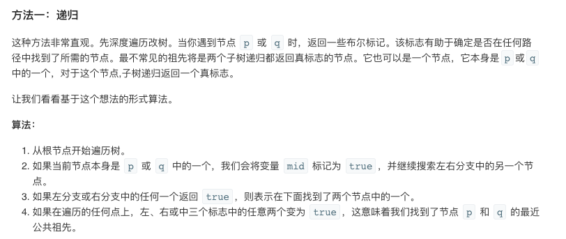

## 题目
给定一个二叉搜索树, 找到该树中两个指定节点的最近公共祖先。

百度百科中最近公共祖先的定义为：“对于有根树 T 的两个结点 p、q，最近公共祖先表示为一个结点 x，满足 x 是 p、q 的祖先且 x 的深度尽可能大（一个节点也可以是它自己的祖先）。”

例如，给定如下二叉搜索树:  root = [6,2,8,0,4,7,9,null,null,3,5]


**示例1**
```
输入: root = [6,2,8,0,4,7,9,null,null,3,5], p = 2, q = 8
输出: 6 
解释: 节点 2 和节点 8 的最近公共祖先是 6。
```

**示例2**
```
输入: root = [6,2,8,0,4,7,9,null,null,3,5], p = 2, q = 4
输出: 2
解释: 节点 2 和节点 4 的最近公共祖先是 2, 因为根据定义最近公共祖先节点可以为节点本身。
```

**说明**
* 所有节点的值都是唯一的。
* p、q 为不同节点且均存在于给定的二叉搜索树中。

## 代码（二叉树的最近公共祖先做法）
```C++
/**
 * Definition for a binary tree node.
 * struct TreeNode {
 *     int val;
 *     TreeNode *left;
 *     TreeNode *right;
 *     TreeNode(int x) : val(x), left(NULL), right(NULL) {}
 * };
 */
class Solution {
public:
    TreeNode* ans;
    bool visit(TreeNode* root, TreeNode* p, TreeNode* q){
        if(root == NULL){
            return false; 
        }
        int left = visit(root->left,p,q) ? 1 : 0;
        int right = visit(root->right,p,q) ? 1 : 0;
        int mid = (root == p || root == q) ? 1 : 0;
        if(left + right + mid >= 2){
            ans = root; 
        }
        return (left + right + mid) > 0;
    }
    TreeNode* lowestCommonAncestor(TreeNode* root, TreeNode* p, TreeNode* q) {
        visit(root,p,q);
        return ans;
    }
};
```

## 代码（二叉搜索树的特殊性质实现 + 迭代）
```C++
/**
 * Definition for a binary tree node.
 * struct TreeNode {
 *     int val;
 *     TreeNode *left;
 *     TreeNode *right;
 *     TreeNode(int x) : val(x), left(NULL), right(NULL) {}
 * };
 */
class Solution {
public:
    TreeNode* lowestCommonAncestor(TreeNode* root, TreeNode* p, TreeNode* q) {
        if(root && root != p && root != q){ 
            while(root){
                if(root->val < p->val && root->val < q->val){
                    root = root->right;
                }else if(root->val > p->val && root->val > q->val){
                    root = root->left;
                }else{
                    return root;
                }
            }
        }
        return root;
    }
};
```

## 代码（二叉搜索树的特殊性质实现 + 递归）
```C++
/**
 * Definition for a binary tree node.
 * struct TreeNode {
 *     int val;
 *     TreeNode *left;
 *     TreeNode *right;
 *     TreeNode(int x) : val(x), left(NULL), right(NULL) {}
 * };
 */
class Solution {
public:
    TreeNode* lowestCommonAncestor(TreeNode* root, TreeNode* p, TreeNode* q) {
        if(root && root != p && root != q){ 
            if (p->val < root->val && q->val < root->val){
                    return lowestCommonAncestor(root->left,p,q);
                }else if (p->val > root->val && q->val > root->val){
                    return lowestCommonAncestor(root->right,p,q);
                }
        }
        return root;
    }
};
```

## 思路

### 解法1

这题可以用查找二叉树的最近公共祖先的方式来计算，再画一个树找找规律之后即可发现递归找最近祖先的规律。


### 解法2

实际上由于二叉搜索树的原因，实际解决方法可以更简单些。

迭代解法

* 首先判断 p 和 q 是否相等，若相等，则直接返回 p 或 q 中的任意一个，程序结束
* 若不相等，则判断 p 和 q 在向左还是向右的问题上，是否达成了一致
* 如果 p 和 q 都小于root, 哥俩一致认为向左👈，则 root = root.left
* 如果 p 和 q 都大于root, 哥俩一致认为向右👉，则 root = root.right
* 如果 p 和 q 哥俩对下一步的路线出现了分歧，说明 p 和 q 在当前的节点上就要分道扬镳了，当前的 root 是哥俩临别前一起走的最后一站
* 返回当前 root

### 解法3

也可以用递归解法


