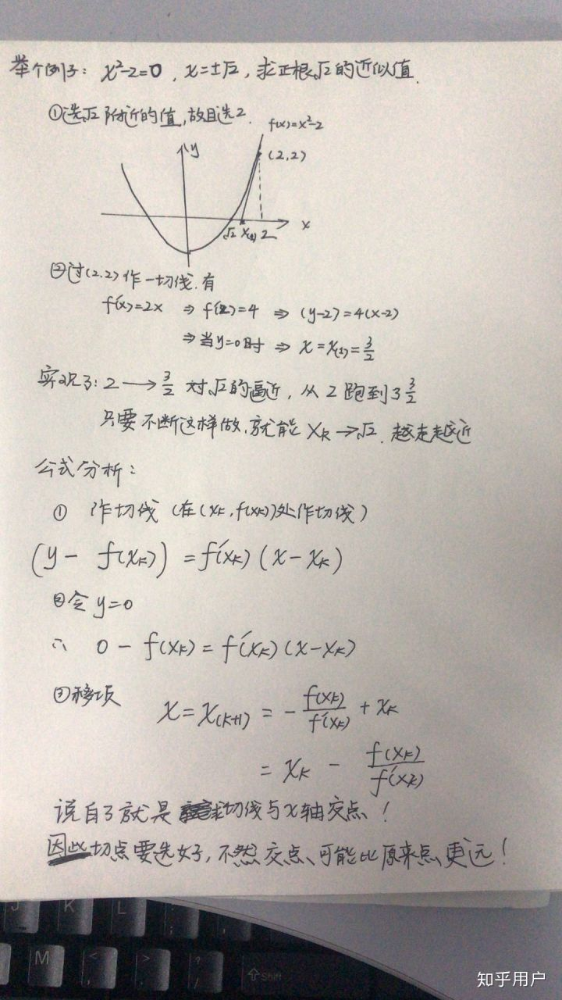

## 题目
实现 int sqrt(int x) 函数。

计算并返回 x 的平方根，其中 x 是非负整数。

由于返回类型是整数，结果只保留整数的部分，小数部分将被舍去。

**示例1**
```
输入: 4
输出: 2
```

**示例2**
```
输入: 8
输出: 2
说明: 8 的平方根是 2.82842..., 
     由于返回类型是整数，小数部分将被舍去。
```

## 代码(二分法)
```C++
class Solution {
public:
    int mySqrt(int x) {
        if(x == 0){
            return 0;
        }
        long left = 1;
        long right = 1 + (x >> 1);
        while(left < right){
            long mid = (left + right + 1) >> 1;
            if (mid * mid > x){
                right = mid - 1;
            }else{
                left = mid;
            }
        }
        return left;
    }
};
```

## 代码(牛顿迭代法)
```C++
class Solution {
public:
    int mySqrt(int x) {
        if (x == 0) return 0;
        double last = 0;
        double current = 1;
        while(current != last)
        {
            last = current;
            current = (current + x/current) / 2;
        }
        return int(current);
    }
};
```

## 思路

这题最直接的想法就是使用二分法来做，但是二分法需要注意若干个坑：

首先最初的上边界要设置为x/2 + 1而不是x/2。这是因为对所有正整数(x/2)^2 > x不总是满足但是对所有正整数(x/2 + 1)^2 > x都是满足的。

其次在二分时要取右中位数，另外在二分时要注意右面可以往低取但是左面不能往高取，否则可能会死循环。

这题也可以用牛顿迭代法来做，之后返回浮点数的整数值即可。
