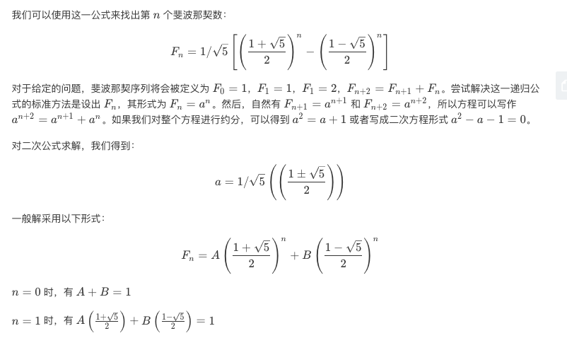
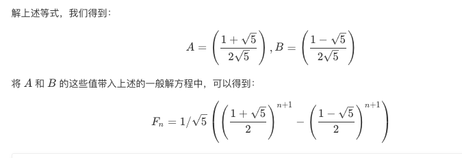

## 题目
假设你正在爬楼梯。需要 n 阶你才能到达楼顶。

每次你可以爬 1 或 2 个台阶。你有多少种不同的方法可以爬到楼顶呢？

注意：给定 n 是一个正整数。

**示例 1**
```
输入： 2
输出： 2
解释： 有两种方法可以爬到楼顶。
1.  1 阶 + 1 阶
2.  2 阶
```

**示例 2**
```
输入： 3
输出： 3
解释： 有三种方法可以爬到楼顶。
1.  1 阶 + 1 阶 + 1 阶
2.  1 阶 + 2 阶
3.  2 阶 + 1 阶
```

## 代码（斐波那契数）
```Java
class Solution {
    public int climbStairs(int n) {
        if(n == 1) return 1;
        if(n == 2) return 2;
        int first = 1;
        int second = 2;
        for(int i = 3;i <= n;i++){
            int tmp = first + second;
            first = second;
            second = tmp;
        }
        return second;
    }
}
```

## 思路

这题最简单的就是使用有记忆的递归或动态规划，可以从低往高构建也可以从高往低构建，主要公式是 dp[i]=dp[i−1]+dp[i−2]，其时间和空间复杂度都是 O(n)，也可以通过斐波那契的方式把空间复杂度减为 O(1)。最好的方法其实是利用数学推导出来的公式直接计算，不仅空间复杂度为 O(1)，时间复杂度为 O(lgn)

推导方式如下：

