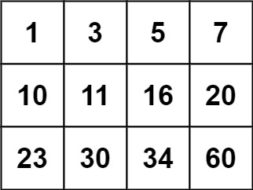

## 题目
编写一个高效的算法来判断 m x n 矩阵中，是否存在一个目标值。该矩阵具有如下特性：

* 每行中的整数从左到右按升序排列。
* 每行的第一个整数大于前一行的最后一个整数。

**示例1**

```
输入：matrix = [[1,3,5,7],[10,11,16,20],[23,30,34,60]], target = 3
输出：true
```

**示例2**

```
输入：matrix = [[1,3,5,7],[10,11,16,20],[23,30,34,60]], target = 13
输出：false
```

**说明**
* m == matrix.length
* n == matrix[i].length
* 1 <= m, n <= 100
* -10^4 <= matrix[i][j], target <= 10^4

## 代码
```JAVA
class Solution {
    public boolean searchMatrix(int[][] matrix, int target) {
        int m = matrix.length;
        int n = matrix[0].length;
        int left = 0;
        int right = m * n - 1;
        while(left <= right){
            int mid = left + ((right - left) >> 1);
            int x = mid / n;
            int y = mid % n;
            if(matrix[x][y] < target){
                left = mid + 1;
            } else if (matrix[x][y] > target){
                right = mid - 1;
            } else {
                return true;
            }
        }
        return false;
    }
}
```

## 思路

相当于在数组上做二分搜索，转换到矩阵中而已，没什么好说的。

* 时间复杂度：O(lg(n*m))
* 空间复杂度：O(1)