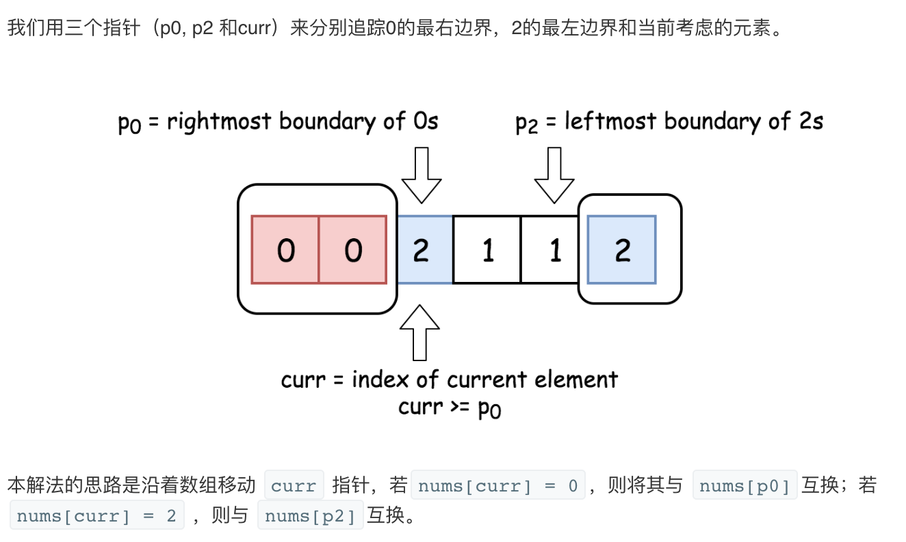

## 题目
给定一个包含红色、白色和蓝色，一共 n 个元素的数组，原地对它们进行排序，使得相同颜色的元素相邻，并按照红色、白色、蓝色顺序排列。

此题中，我们使用整数 0、 1 和 2 分别表示红色、白色和蓝色。

注意: 不能使用代码库中的排序函数来解决这道题。

**示例1**
```
输入: [2,0,2,1,1,0]
输出: [0,0,1,1,2,2]
```
**进阶**
* 一个直观的解决方案是使用计数排序的两趟扫描算法。
* 首先，迭代计算出0、1 和 2 元素的个数，然后按照0、1、2的排序，重写当前数组。
* 你能想出一个仅使用常数空间的一趟扫描算法吗？

## 代码(技术排序)
```C++
class Solution {
public:
    void sortColors(vector<int>& nums) {
        map<int, int> tmp;
        for (int i = 0; i < 3; i++) {
            tmp.insert(make_pair(i, 0));
        }
        for (int i = 0; i < nums.size(); i++) {
            tmp[nums[i]]++;
        }
        int k = 0;
        for (int i = 0; i < 3; i++) {
            for (int j = 0; j < tmp[i]; j++) {
                nums[k++] = i;
            }
        }
    }
};
```

## 代码(荷兰国旗)
```C++
class Solution {
public:
    void sortColors(vector<int>& nums) {
        // 对于所有 idx < left : nums[idx] = 0
        int left = 0; 
        // 对于所有 idx > right : nums[idx] = 2
        int right = nums.size() - 1;
        // curr 是当前考虑元素的下标
        int current = 0;
        while (current <= right) {
          if (nums[current] == 0) {
            swap(nums[current++], nums[left++]);
          }else if (nums[current] == 2) {
            swap(nums[current], nums[right--]);
          }else{ 
              current++;
          }
        }
    }
};
```
## 思路

### 解法1
最直接就是利用两趟遍历扫描的计数排序方法，统计数0，1，2的个数再把他们放在对应的位置。

* 时间复杂度 :由于对长度 N 的数组进行了两次遍历，时间复杂度为O(N)。
* 空间复杂度 :尽管使用了map，但只有三个key，所以空间复杂度仍为 O(1) 。

### 解法2
本问题被称为[荷兰国旗问题](https://en.wikipedia.org/wiki/Dutch_national_flag_problem)。

* 初始化0的最右边界：left = 0。在整个算法执行过程中 nums[idx < left] = 0.
* 初始化2的最左边界 ：right = n - 1。在整个算法执行过程中 nums[idx > right] = 2.
* 初始化当前考虑的元素序号 ：current = 0.
* While current <= right :
    * 若 nums[current] = 0 ：交换第 current 个 和 第 left 个元素，并将指针都向右移。
    * 若 nums[current] = 2 ：交换第 current 个和第 right 个元素，并将 right 指针左移 。
    * 若 nums[current] = 1 ：将指针 current 右移。

* 时间复杂度 :由于对长度 N 的数组进行了一次遍历，时间复杂度为O(N)。
* 空间复杂度 :由于只使用了常数空间，空间复杂度为 O(1) 。