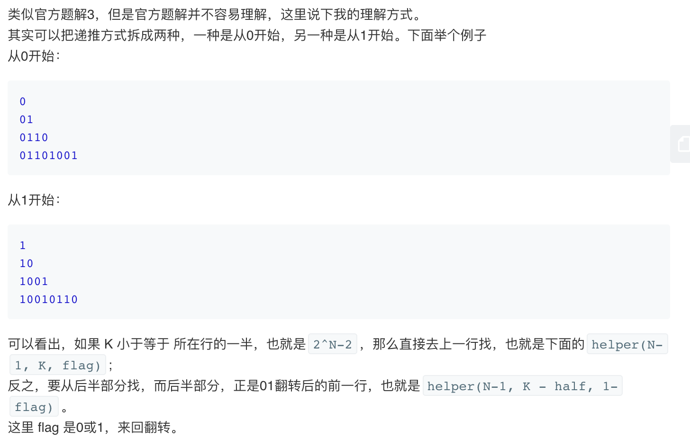

## 题目
在第一行我们写上一个 0。接下来的每一行，将前一行中的0替换为01，1替换为10。

给定行数 N 和序数 K，返回第 N 行中第 K个字符。（K从1开始）

**示例1**
```
输入: N = 1, K = 1
输出: 0

输入: N = 2, K = 1
输出: 0

输入: N = 2, K = 2
输出: 1

输入: N = 4, K = 5
输出: 1

解释:
第一行: 0
第二行: 01
第三行: 0110
第四行: 01101001
```

**注意**
* N 的范围 [1, 30].
* K 的范围 [1, 2^(N-1)].


## 代码（递归父变体）
```C++
class Solution {
public:
    int kthGrammar(int N, int K) {
        if (N == 1) return 0;
        return (~K & 1) ^ kthGrammar(N-1, (K+1)/2);
    }
};
```

## 代码（递归翻转变体）
```C++
class Solution {
public:
    int kthGrammar(int N, int K) {
        return helper(N, K, 0);
    }

    int helper(int N, int K, int flag) {
        if (N == 1) return flag;
        int half = (1 << (N-2));
        if (K <= half) {
            return helper(N-1, K, flag);
        } else {
            return helper(N-1, K - half, flag ^ 1);
        }
    }
};
```


## 思路

最自然的解法就是记忆化自底向上迭代或递归了，可惜每行字符串的长度都是上行字符串长度的两倍，这么下去时间和空间复杂度都太高了，因此必须找到规律。可以参考此[博客](https://leetcode-cn.com/explore/featured/card/recursion-i/260/conclusion/1232/)

### 解法1

可以通过找规律对普通递归进行一些优化。
*  父节点位置：（k+1）/2
* 当k是奇数（k%2=1），父节点值为1时，k对应的值为1；
* 当k是偶数（k%2=0），父节点值为1时，k对应的值为0；
* 当k是奇数（k%2=1），父节点值为0时，k对应的值为0；
* 当k是偶数（k%2=0），父节点值为0时，k对应的值为1；
* 总结：相同为1，不同为0; 正好和“异或”^相反，所以对k取反，再&1，判断位置奇偶性，再与父节点的值异或，即可得当前值.

* 时间复杂度：O(N)。找出答案需要 N−1 步。
* 空间复杂度：O(1)。

### 解法2
递归做法


* 时间复杂度：O(N)。找出答案需要 N−1 步。
* 空间复杂度：O(1)。
