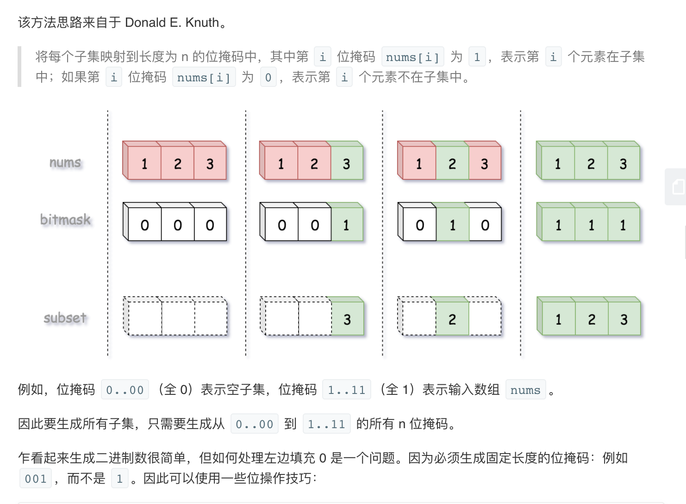
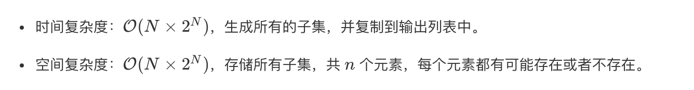

## 题目
给定一组不含重复元素的整数数组 nums，返回该数组所有可能的子集（幂集）。

说明：解集不能包含重复的子集。

**示例 1**
```
输入：nums = [1,2,3]
输出：
[
  [3],
  [1],
  [2],
  [1,2,3],
  [1,3],
  [2,3],
  [1,2],
  []
]
```

## 代码（经典密码学）
```Java
class Solution {
    public List<List<Integer>> subsets(int[] nums) {
        int len = 1 << nums.length;
        List<List<Integer>> result = new ArrayList<>(len);
        for(int mask = 0;mask < len;mask++){
            List<Integer> line = new ArrayList<>();
            for(int i = 0;i < nums.length;i++){
                if(((mask >>> i) & 1) == 1) {
                    line.add(nums[i]);
                }
            }
            result.add(line);
        }
        return result;
    }
}
```

## 代码（回溯）
```Java
class Solution {
    private List<List<Integer>> result = new ArrayList<>();
    private int[] nums; 

    public List<List<Integer>> subsets(int[] nums) {
        this.nums = nums;
        dfs(0, new LinkedList<>());
        return result;
    }

    public void dfs(int currentIndex, LinkedList<Integer> path) {
        result.add(new ArrayList<>(path));
        for(int i = currentIndex;i < nums.length;i++){
            path.addLast(nums[i]);
            dfs(i + 1, path);
            path.removeLast();
        }
    }
}
```

## 思路

### 解法 1

这个解法之前和某位学长讨论过，据说是他去 MSRA 面试时出的面试题，感觉这个解法非常牛逼，就记下来了。十分巧妙，建议背背。




### 解法 2

经典回溯做法，可以参考 [博客](https://labuladong.github.io/algo/1/9/) 套用模板。