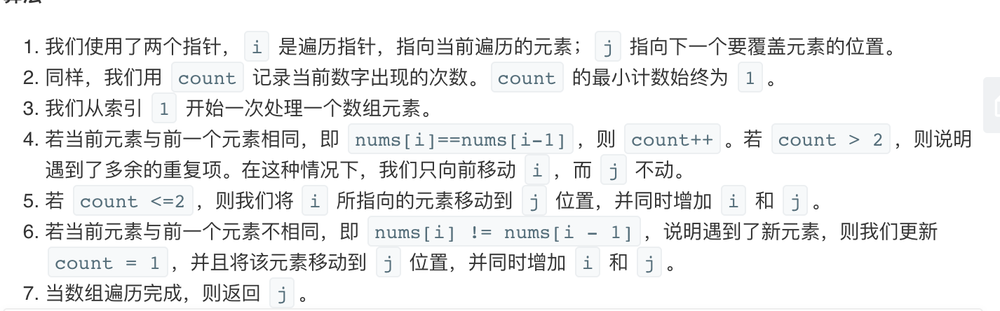

## 题目
给定一个排序数组，你需要在原地删除重复出现的元素，使得每个元素最多出现两次，返回移除后数组的新长度。

不要使用额外的数组空间，你必须在原地修改输入数组并在使用 O(1) 额外空间的条件下完成。

**示例1**
```
给定 nums = [1,1,1,2,2,3],

函数应返回新长度 length = 5, 并且原数组的前五个元素被修改为 1, 1, 2, 2, 3 。

你不需要考虑数组中超出新长度后面的元素。
```

**示例2**
```
给定 nums = [0,0,1,1,1,1,2,3,3],

函数应返回新长度 length = 7, 并且原数组的前五个元素被修改为 0, 0, 1, 1, 2, 3, 3 。

你不需要考虑数组中超出新长度后面的元素。
```

## 代码(覆盖遍历)
```JAVA
class Solution {
    public int removeDuplicates(int[] nums) {
        if (nums.length < 3){
            return nums.length;
        }
        int current = 1;
        int times = 1;
        for(int i = 1;i < nums.length;i++){
            if (nums[i-1] == nums[i]) {
                times++;
            } else {
                times = 1;
            }
            if(times <= 2){
                nums[current++] = nums[i];
            }
        }
        return current;
    }
}
```

## 代码(覆盖遍历优化)
```JAVA
class Solution {
    public int removeDuplicates(int[] nums) {
        int k = 2;
        if (nums.length <= k){
            return nums.length;
        }
        int current = 0;
        for(int num : nums){
            if (current < k || num != nums[current - k]){
                nums[current++] = num;
            }
        }
        return current;
    }
}
```

## 思路

### 解法1


* 时间复杂度：O(N)，我们遍历每个数组元素一次。
* 空间复杂度：O(1)。

### 解法2
也可以有一些写法上的优化。时间和空间复杂度不变。可以参考此博客[重复k个数的通解](https://leetcode-cn.com/problems/remove-duplicates-from-sorted-array-ii/solution/gong-shui-san-xie-guan-yu-shan-chu-you-x-glnq/)。