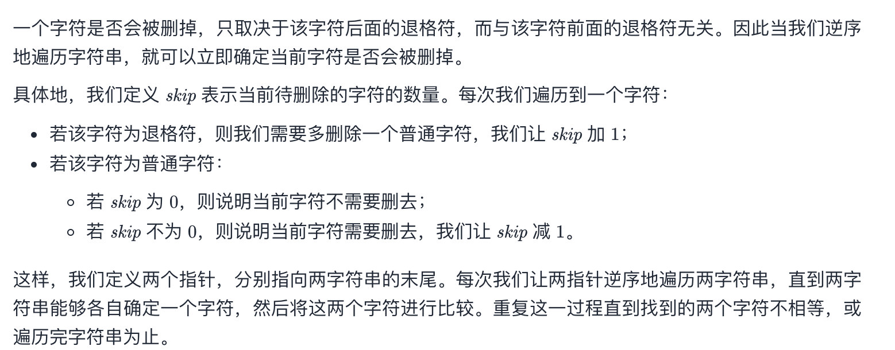

## 题目
给定 s 和 t 两个字符串，当它们分别被输入到空白的文本编辑器后，请你判断二者是否相等。# 代表退格字符。

如果相等，返回 true ；否则，返回 false 。

注意：如果对空文本输入退格字符，文本继续为空。

**示例1**
```
输入：s = "ab#c", t = "ad#c"
输出：true
解释：S 和 T 都会变成 “ac”。
```

**示例2**
```
输入：s = "ab##", t = "c#d#"
输出：true
解释：s 和 t 都会变成 “”。
```

**示例3**
```
输入：s = "a##c", t = "#a#c"
输出：true
解释：s 和 t 都会变成 “c”。
```

**示例4**
```
输入：s = "a#c", t = "b"
输出：false
解释：s 会变成 “c”，但 t 仍然是 “b”。
```

**说明**
* 1 <= s.length, t.length <= 200
* s 和 t 只含有小写字母以及字符 '#'

**进阶**
* 你可以用 O(N) 的时间复杂度和 O(1) 的空间复杂度解决该问题吗？


## 代码
```JAVA
class Solution {
    public boolean backspaceCompare(String s, String t) {
        int left = s.length() - 1;
        int right = t.length() - 1;
        while(true){
            left = getNextCompareIndex(s, left);
            right = getNextCompareIndex(t, right);
            if (left < 0 || right < 0){
                if (left < 0 && right < 0){
                    return true;
                } else {
                    return false;
                }
            } else if (s.charAt(left) == t.charAt(right)) {
                left--;
                right--;
            } else {
                return false;
            }
        }
    }

    public int getNextCompareIndex(String s, int index){
        int skipTimes = 0;
        while(index >= 0){
            if(s.charAt(index) == '#'){
                skipTimes++;
            } else if (skipTimes != 0){
                skipTimes--;
            } else {
                break;
            }
            index--;
        }
        return index;
    }
}
```


## 思路

对于本题，最简单的思路便是通过栈的方式遍历并整理每个字符串并最后做一个比较。但可惜这样的方式时间复杂度并不是 O(1) 而是 O(N)。

实际上要想达到 O(1) 的空间复杂度，需要采用双指正遍历的方式。具体算法如图所示：
