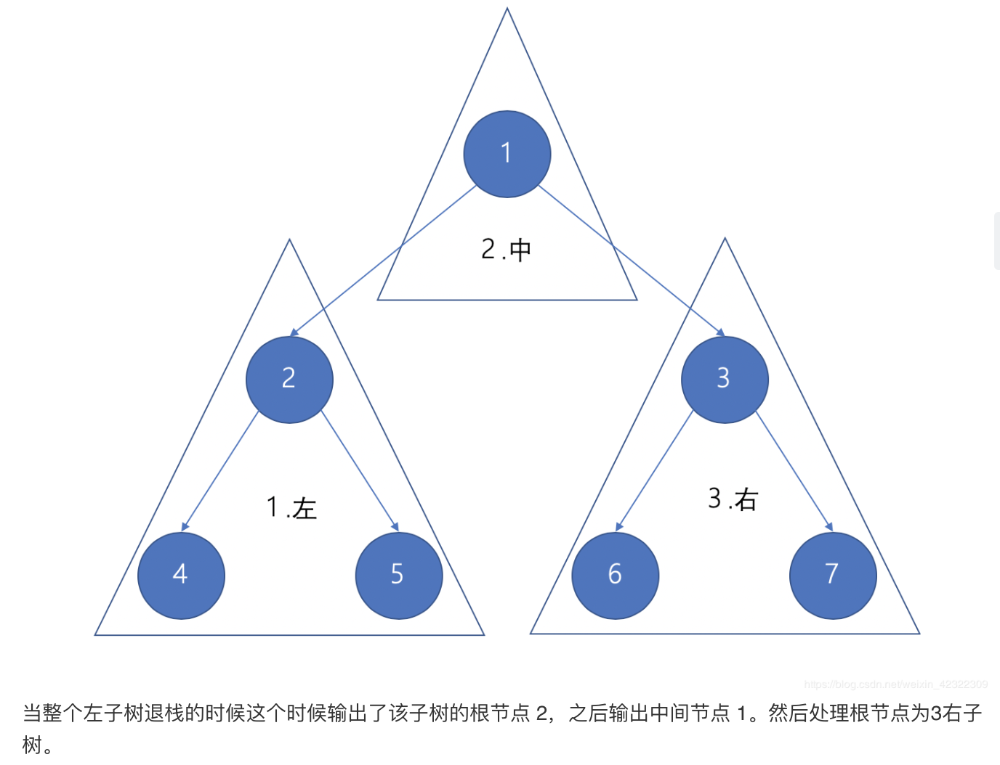

## 题目
给定一个二叉树，返回它的中序 遍历。

**示例 1**
```
输入：[1,null,2,3]
   1
    \
     2
    /
   3

输出：[1,3,2]
```

**说明**

* 进阶：递归算法很简单，你可以通过迭代算法完成吗？

## 代码（系统栈遍历）
```Java
/**
 * Definition for a binary tree node.
 * public class TreeNode {
 *     int val;
 *     TreeNode left;
 *     TreeNode right;
 *     TreeNode() {}
 *     TreeNode(int val) { this.val = val; }
 *     TreeNode(int val, TreeNode left, TreeNode right) {
 *         this.val = val;
 *         this.left = left;
 *         this.right = right;
 *     }
 * }
 */
class Solution {
    private List<Integer> res = new ArrayList<>();
    public List<Integer> inorderTraversal(TreeNode root) {
        if (root != null){
            inorderTraversal(root.left);
            res.add(root.val);
            inorderTraversal(root.right);
        }
        return res;
    }
}
```

## 代码（显式栈遍历）
```Java
/**
 * Definition for a binary tree node.
 * public class TreeNode {
 *     int val;
 *     TreeNode left;
 *     TreeNode right;
 *     TreeNode() {}
 *     TreeNode(int val) { this.val = val; }
 *     TreeNode(int val, TreeNode left, TreeNode right) {
 *         this.val = val;
 *         this.left = left;
 *         this.right = right;
 *     }
 * }
 */
class Solution {
    private List<Integer> res = new ArrayList<>();
    public List<Integer> inorderTraversal(TreeNode root) {
        if (root != null){
            Stack<TreeNode> stack = new Stack<>();
            TreeNode cur = root;
            while(!stack.isEmpty() || cur != null){
                while(cur != null){
                    stack.push(cur);
                    cur = cur.left;
                }
                TreeNode tmp = stack.pop();
                res.add(tmp.val);
                if(tmp.right != null){
                    cur = tmp.right;
                }
            }
        }
        return res;
    }
}
```

## 思路

### 解法 1
递归法

### 解法 2
迭代法
1. 创建一个 Stack，然后按 左 中 右的顺序输出节点。
2. 尽可能的将这个节点的左子树压入 Stack，此时栈顶的元素是最左侧的元素，其目的是找到一个最小单位的子树（也就是最左侧的一个节点），并且在寻找的过程中记录了来源，才能返回上层，同时在返回上层的时候已经处理完毕左子树了。
3. 当处理完最小单位的子树时，返回到上层处理了中间节点。（如果把整个左中右的遍历都理解成子树的话，就是处理完 左子树->中间（就是一个节点）->右子树）
4. 如果有右节点，其也要进行中序遍历。
