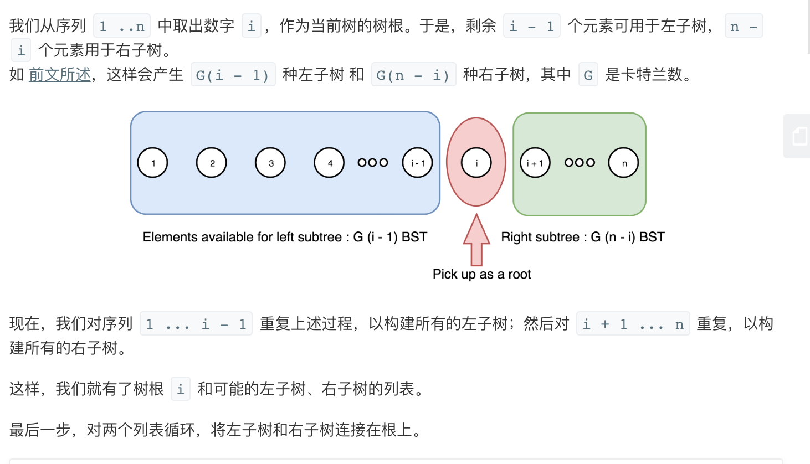
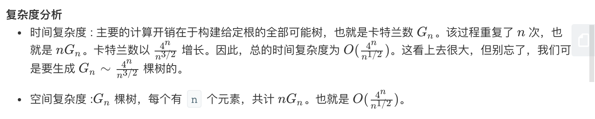

## 题目
给定一个整数 n，生成所有由 1 ... n 为节点所组成的二叉搜索树。

**示例 1**
```
输入：3
输出：
[
  [1,null,3,2],
  [3,2,null,1],
  [3,1,null,null,2],
  [2,1,3],
  [1,null,2,null,3]
]
解释：
以上的输出对应以下 5 种不同结构的二叉搜索树：

   1         3     3      2      1
    \       /     /      / \      \
     3     2     1      1   3      2
    /     /       \                 \
   2     1         2                 3
```

## 代码
```Java
/**
 * Definition for a binary tree node.
 * public class TreeNode {
 *     int val;
 *     TreeNode left;
 *     TreeNode right;
 *     TreeNode() {}
 *     TreeNode(int val) { this.val = val; }
 *     TreeNode(int val, TreeNode left, TreeNode right) {
 *         this.val = val;
 *         this.left = left;
 *         this.right = right;
 *     }
 * }
 */
class Solution {
    private List<TreeNode> result = new ArrayList<>();

    public List<TreeNode> generateTrees(int n) {
        if(n == 0) return result;
        return generateTrees(1, n);
    }

    public List<TreeNode> generateTrees(int start, int end) {
        if(start > end) {
            return Collections.singletonList(null);
        }
        List<TreeNode> result = new ArrayList<>();
        for(int i = start;i <= end;i++){
            List<TreeNode> leftNodes = generateTrees(start, i - 1);
            List<TreeNode> rightNodes = generateTrees(i + 1, end);
            for(TreeNode leftNode : leftNodes){
                for(TreeNode rightNode : rightNodes){
                    result.add(new TreeNode(i, leftNode, rightNode));
                }
            }
        }
        return result;
    }
}
```

## 思路

递归比较自然



还有一些比如动规的其他做法，可以参考此 [博客](https://leetcode-cn.com/problems/unique-binary-search-trees-ii/solution/xiang-xi-tong-su-de-si-lu-fen-xi-duo-jie-fa-by-2-7/)