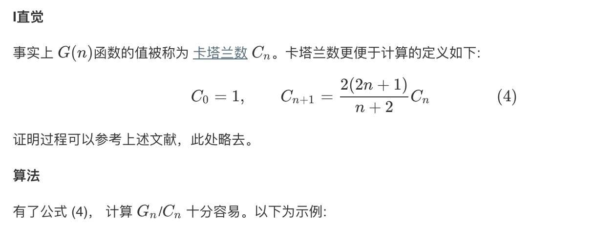

## 题目
给定一个整数 n，生成所有由 1 ... n 为节点所组成的二叉搜索树。

**示例1**
```
输入: 3
输出: 5
解释:
给定 n = 3, 一共有 5 种不同结构的二叉搜索树:

   1         3     3      2      1
    \       /     /      / \      \
     3     2     1      1   3      2
    /     /       \                 \
   2     1         2                 3
```

## 代码(动规)
```C++
class Solution {
public:
    int numTrees(int n) {
        vector<int> G(n + 1);
        G[0] = 1;
        G[1] = 1;

        for (int i = 2; i <= n; ++i) {
            for (int j = 1; j <= i; ++j) {
                G[i] += G[j - 1] * G[i - j];
            }
        }
        return G[n];
    }
};
```

## 代码(数学演绎)
```C++
class Solution {
public:
    int numTrees(int n) {
        // Note: we should use long here instead of int, otherwise overflow
        long C = 1;
        for (int i = 1; i < n; ++i) {
            C = C * 2 * (2 * i + 1) / (i + 2);
        }
        return (int) C;
    }
};
```

## 思路

### 解法1


### 解法2

