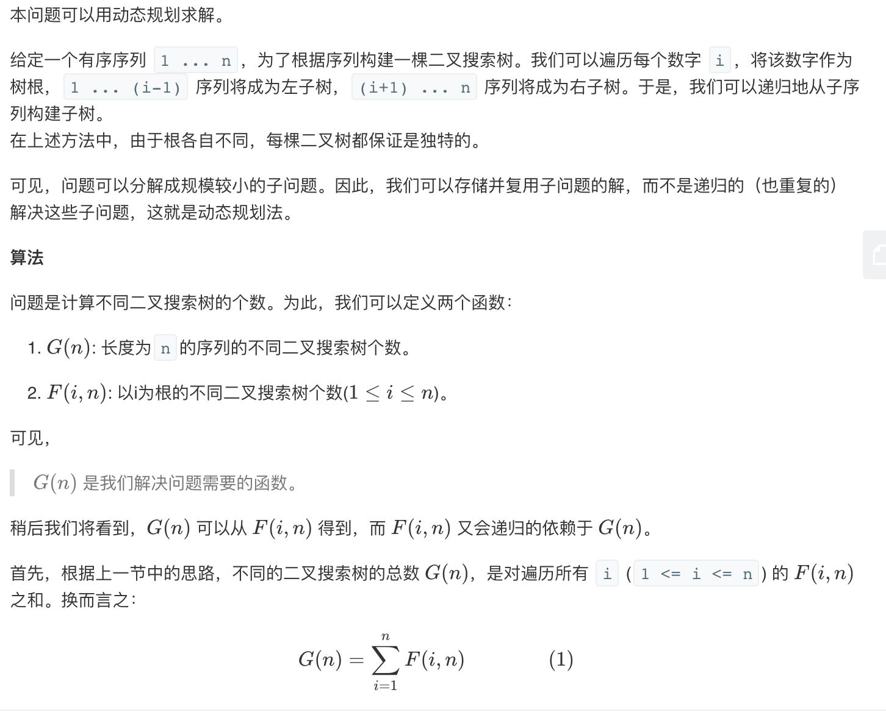
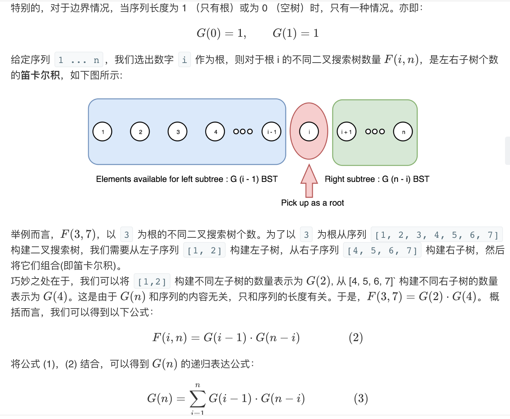
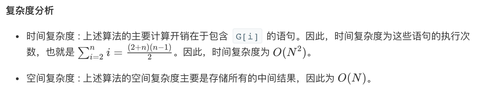

## 题目
给定一个整数 n，生成所有由 1 ... n 为节点所组成的二叉搜索树。

**示例 1**
```
输入：3
输出：5
解释：
给定 n = 3, 一共有 5 种不同结构的二叉搜索树：

   1         3     3      2      1
    \       /     /      / \      \
     3     2     1      1   3      2
    /     /       \                 \
   2     1         2                 3
```

## 代码
```Java
class Solution {
    public int numTrees(int n) {
        int[] result = new int[n + 1];
        result[0] = 1;
        result[1] = 1;
        for(int i = 2;i <= n;i++){
            for(int j = 1;j <= i;j++){
                result[i] += result[j - 1] * result[i - j];
            }
        } 
        return result[n];
    }
}
```

## 思路

动规时间复杂度为 O(N^2)，空间复杂度为 O(N)。更好的数学方案是直接计算卡特兰数，时间复杂度为 O(N)，空间复杂度为 O(1)，具体可参考官方 [解答](https://leetcode.cn/problems/unique-binary-search-trees/solution/bu-tong-de-er-cha-sou-suo-shu-by-leetcode-solution/)。


