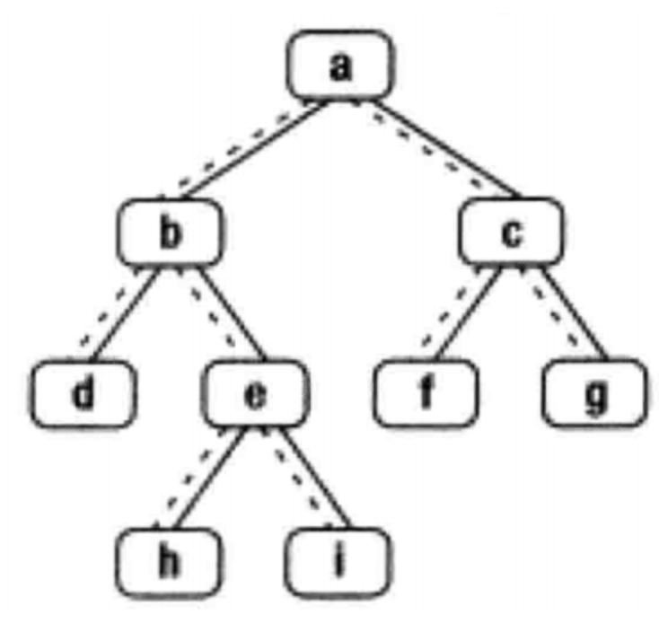

## 题目
给定一个二叉树其中的一个结点，请找出中序遍历顺序的下一个结点并且返回。注意，树中的结点不仅包含左右子结点，同时包含指向父结点的 next 指针。下图为一棵有 9 个节点的二叉树。树中从父节点指向子节点的指针用实线表示，从子节点指向父节点的用虚线表示



**示例 1**
```
输入：{8,6,10,5,7,9,11},8
返回值：9
```

**示例 2**
```
输入：{8,6,10,5,7,9,11},6
返回值：7 
```

**示例 3**
```
输入：{1,2,#,#,3,#,4},4
返回值：1 
```

**示例 4**
```
输入：{5},5
返回值："null"
说明：不存在，后台打印"null"  
```

**限制**
* 0 <= 节点个数 <= 5000

## 代码
```JAVA
/*
public class TreeLinkNode {
    int val;
    TreeLinkNode left = null;
    TreeLinkNode right = null;
    TreeLinkNode next = null;

    TreeLinkNode(int val) {
        this.val = val;
    }
}
*/
public class Solution {
    public TreeLinkNode GetNext(TreeLinkNode pNode) {
        if (pNode == null){
            return null;
        }
        TreeLinkNode result = null;
        if (pNode.right != null){
            result = pNode.right;
            while (result.left != null){
                result = result.left;
            }
        } else if (pNode.next != null){
            result = pNode.next;
            while(result != null && result.left != pNode){
                pNode = result;
                result = result.next;
            }
        }
        return result;
    }
}
```

## 思路

* 分为 5 种情况去考虑：
    * 如果 pNode 为 null，则返回 null；
    * 如果 pNode 存在右子树，则返回其右子树的最左节点。
    * 否则如果 pNode 是其父节点的左子树节点，则返回其父节点。
    * 否则如果 pNode 是其父节点的右子树节点，则向上迭代，直至找到一个祖先使得其左子树节点在迭代路径中。
    * 否则说明找不到下一个节点，返回 null；

* 空间复杂度 O(1)
* 时间复杂度 O(n)